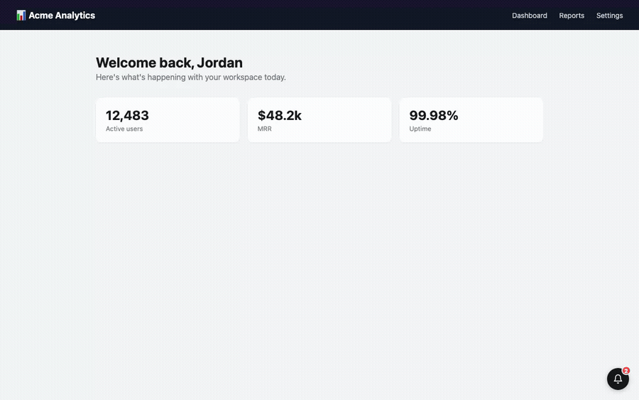
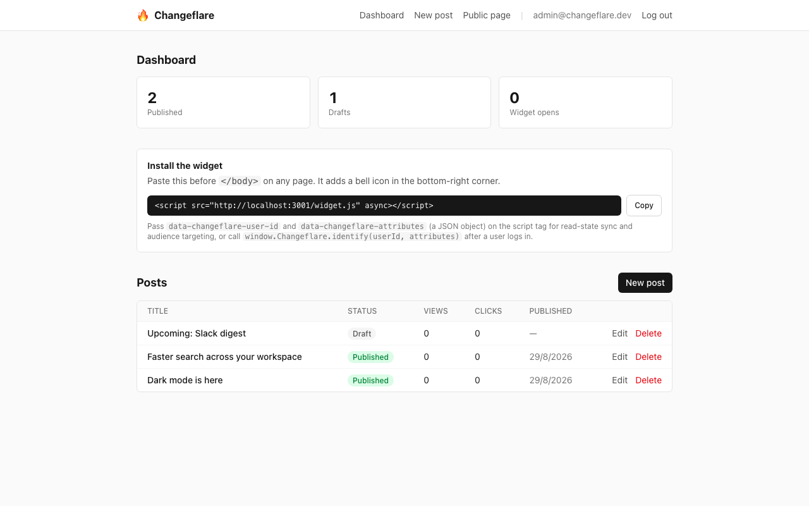
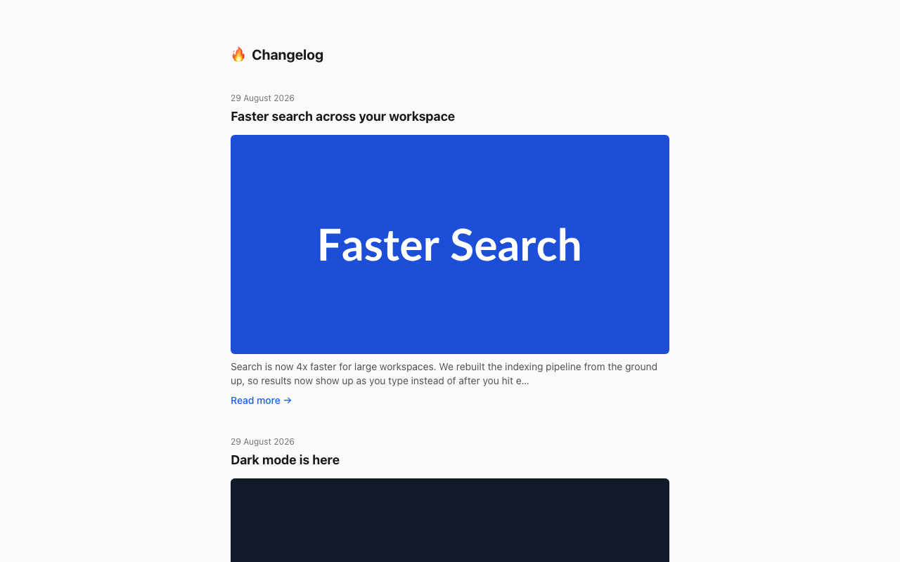

**Changeflare is a self-hosted "what's new" widget for your product.** Paste one `<script>` tag to add a bell icon with an unread-count badge to any page, write posts from a small admin dashboard, and see who actually opens them — all without the monthly-active-user pricing meter that Beamer runs on.

[](https://github.com/Laaaaksh/changeflare/stargazers)
[](https://github.com/Laaaaksh/changeflare/actions/workflows/ci.yml)
[](https://github.com/Laaaaksh/changeflare/releases)
[](LICENSE)
[](https://nodejs.org)
[](#install)

[Install](#install) · [Usage](#usage) · [Configuration](#configuration) · [Limits](#limits) · [Changelog](CHANGELOG.md) · [Contributing](CONTRIBUTING.md) · [License](#license)
[Code of conduct](CODE_OF_CONDUCT.md) · [Security](SECURITY.md)

## What it does

- Adds a bell-icon changelog widget to any page with a single `<script>` tag — no build step, no framework required, ~3.6 KB gzipped
- Shows an unread-count badge that clears when a visitor opens the panel, synced server-side for logged-in users across devices
- Ships a Markdown post editor with a live preview, draft/publish states, and a cover image
- Tracks per-post views and clicks, plus total widget opens, right in the dashboard
- Targets posts to specific visitors by attribute (e.g. `plan: "pro"`) — simple matching, not a segmentation engine to configure
- Publishes a public, unauthenticated changelog page at `/changelog` from the same posts
- Runs on infrastructure you already have — one Node process and Postgres, no paid SaaS dependency, no telemetry



## Why self-host this

Beamer's free tier caps out at 1,000 monthly active users, and its paid tiers ($49–299+/mo) still bill on MAU — so the widget gets more expensive exactly when your product is succeeding. No maintained open-source alternative ships the actual Beamer shape (embeddable widget + unread badge + view/click analytics + audience targeting): [Fider](https://github.com/getfider/fider) is a great feedback-board/voting tool, but it doesn't do this. Changeflare is deliberately small — a CMS and a JS snippet — so a single Postgres database and one Node process is the entire bill.

## Requirements

- Node.js 20+ and npm (only if running outside Docker)
- A Postgres database — `docker compose up` provisions one for free, or point `DATABASE_URL` at any Postgres you already have (Neon, Supabase, Railway, RDS, ...)
- Docker + Docker Compose, for the one-command self-hosting path (recommended)

## Install

**Docker Compose (recommended — brings up Postgres too):**

```bash
git clone https://github.com/Laaaaksh/changeflare.git
cd changeflare
cp .env.example .env        # set SESSION_SECRET — see the comment in the file
docker compose up --build
```

Changeflare is now running at `http://localhost:3000`. Open it and create your admin account.

If port 5432 or 3000 is already taken on your machine, set `POSTGRES_PORT`
and/or `APP_PORT` in `.env` (commented out in `.env.example`) before running
`docker compose up --build`.

**From source, against your own Postgres:**

```bash
git clone https://github.com/Laaaaksh/changeflare.git
cd changeflare
npm install
cp apps/web/.env.example apps/web/.env   # set DATABASE_URL and SESSION_SECRET
npm run db:migrate:deploy
npm run build
npm start
```

## Usage

1. Open your instance and create the admin account (first run only).
2. From the dashboard, click **New post**, write it in Markdown, and hit **Publish**.
3. Copy the install snippet the dashboard shows you, and paste it before `</body>` on any page:

   ```html
   <script src="https://your-instance.example/widget.js" async></script>
   ```

4. Reload that page — a bell icon appears in the bottom-right corner with an unread badge for your new post.



The same posts are also published at `https://your-instance.example/changelog`, an unauthenticated page you can link from a footer even if you also embed the widget.



## Configuration

**Server** — set via environment variables (see `apps/web/.env.example`):

| Variable | Required | Purpose |
| --- | --- | --- |
| `DATABASE_URL` | yes | Postgres connection string |
| `SESSION_SECRET` | yes | Random 16+ char secret signing admin session cookies (`openssl rand -base64 32`) |

**Widget** — configure per install via `data-*` attributes on the script tag, or the JS API:

```html
<script
  src="https://your-instance.example/widget.js"
  data-changeflare-user-id="user_123"
  data-changeflare-attributes='{"plan":"pro"}'
  async
></script>
```

- `data-changeflare-user-id` — a stable external id, so a visitor's read state follows them across browsers/devices instead of living only in `localStorage`
- `data-changeflare-attributes` — a JSON object matched against each post's audience conditions (set per-post in the editor); a post with no conditions shows to everyone
- `data-changeflare-selector` / `data-changeflare-position` — mount the trigger inside an existing element instead of a floating corner button

For a single-page app where the visitor logs in after the widget has already loaded, call `window.Changeflare.identify(userId, attributes)` instead of relying on the initial script tag.

## Limits

- **Single admin account.** There's no invite flow, no roles, no team
  members — whoever runs `/setup` first is the only account that can ever
  log in. Fine for a solo maintainer or small team sharing one login; not
  built for per-person access control.
- **Audience targeting is simple attribute matching, not a rules engine.**
  A post's conditions are ANDed against whatever attributes the widget was
  given — no OR logic, no percentage rollouts, no scheduling.
- **No login rate limiting.** `SECURITY.md` scopes this out deliberately —
  put a self-hosted instance behind a reverse proxy or WAF that rate-limits
  `/api/login` if that matters for your deployment.
- **No TLS termination.** Changeflare serves plain HTTP; run it behind a
  reverse proxy (Caddy, nginx, your platform's load balancer) for anything
  reachable outside `localhost`.
- **Test coverage is unit-level only.** The sanitizer, auth, and audience
  logic all have real assertion-based tests, but there's no browser/e2e test
  of the widget's actual DOM (bell icon, badge, Shadow DOM panel) yet.
- **No email digests, in-app product tours, or roadmap/voting.** Changeflare
  is deliberately just a changelog widget — [Fider](https://github.com/getfider/fider)
  covers voting and roadmaps if you need that instead.

## Changelog

See [CHANGELOG.md](CHANGELOG.md).

## Contributing

See [CONTRIBUTING.md](CONTRIBUTING.md) for the build/test workflow and release process.

## Security

See [SECURITY.md](SECURITY.md) for supported versions and how to report a vulnerability privately.

## Star this repo

If Changeflare is useful to you, [starring it](https://github.com/Laaaaksh/changeflare/stargazers) helps other people find it.

## License

[MIT](LICENSE)
